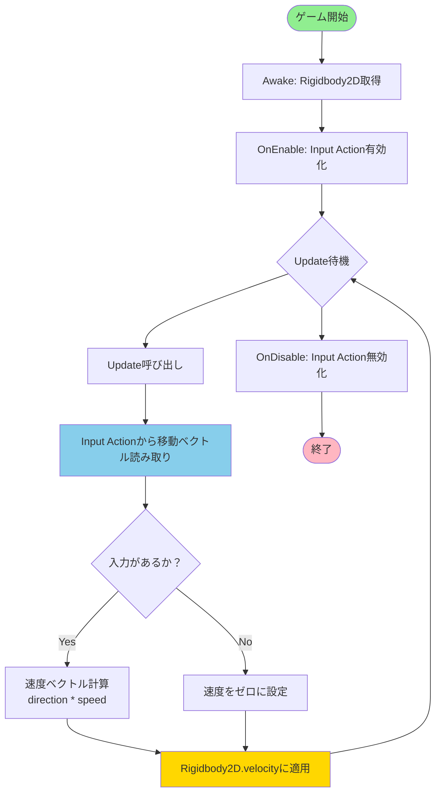

# PlayerMovement2D アクティビティ図

WASD入力による2D移動の処理フローを示します。

## 処理詳細

### 初期化フェーズ
1. **Awake**: 必要なコンポーネント（Rigidbody2D）を取得
2. **OnEnable**: Input Actionを有効化し、入力イベントの受信を開始

### 更新フェーズ（毎フレーム）
1. **入力読み取り**: Input Systemから移動ベクトル（Vector2）を取得
2. **速度計算**: 入力方向 × 速度プロパティ
3. **物理適用**: Rigidbody2Dのvelocityプロパティに設定

### 終了フェーズ
1. **OnDisable**: Input Actionを無効化し、リソースを解放
