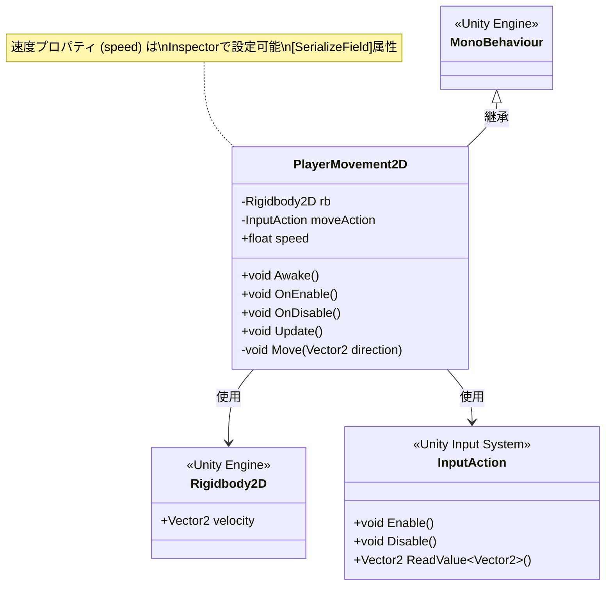

# PlayerMovement2D クラス図

WASD移動を行うMonoBehaviourクラスの構造を示します。



## クラス詳細

### PlayerMovement2D

WASD入力による2D移動を実現するコンポーネント。

#### プロパティ
| 名前 | 型 | 可視性 | 説明 |
|------|-----|--------|------|
| speed | float | public | 移動速度（Inspector設定可） |
| rb | Rigidbody2D | private | Rigidbody2Dコンポーネント参照 |
| moveAction | InputAction | private | 移動入力アクション |

#### メソッド
| 名前 | 戻り値 | 説明 |
|------|--------|------|
| Awake() | void | Rigidbody2Dコンポーネントを取得 |
| OnEnable() | void | Input Actionを有効化 |
| OnDisable() | void | Input Actionを無効化 |
| Update() | void | 毎フレーム入力を読み取り移動処理を実行 |
| Move(Vector2) | void | 指定された方向に移動（private） |

## 依存関係

### Unity Engine
- **MonoBehaviour**: Unityのコンポーネントシステムの基底クラス
- **Rigidbody2D**: 2D物理演算コンポーネント

### Unity Input System
- **InputAction**: 入力アクションの管理と読み取り

## 使用例

```csharp
// GameObjectにアタッチ
// 1. Rigidbody2Dコンポーネントを追加
// 2. PlayerMovement2Dコンポーネントを追加
// 3. Inspectorでspeedを設定（例: 5.0f）
// 4. Input Actionを設定
```
